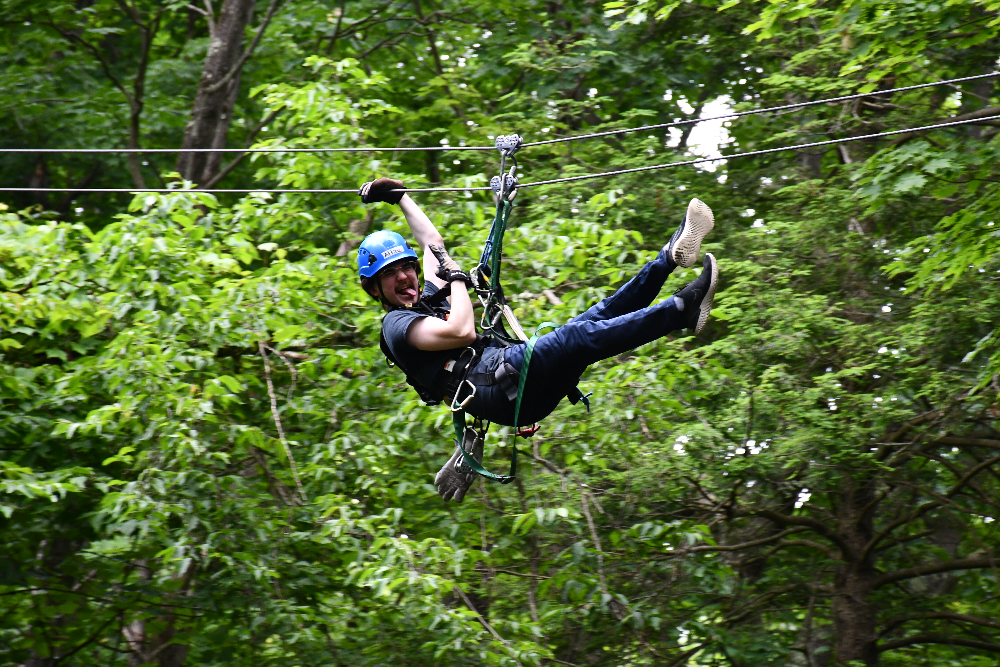

# About Me

*Pictured: Me enjoying my summer job as a zipline guide, c. 2024.*

Hello, I'm Atticus. I'm a game programmer specializing in gameplay and UI systems.

I graduated from Champlain College in May of 2026 with a B.S. in Game Programming and a minor in Mathematics. While I was there, I was on the development team of multiple game projects, large and small. I found that I really enjoy building and maintaining systems for gameplay and UI (hence my specialties) because they have such a direct impact on the experience of a game. It was awesome to be able to create amazing stuff alongside other talented people, and I'm excited for my next opportunity!

Some of my favorite games include Deltarune, Hollow Knight, and Super Mario Galaxy. When I'm not playing games, I also enjoy biking, reading manga, and really wishing I knew people I could play D&D with.
